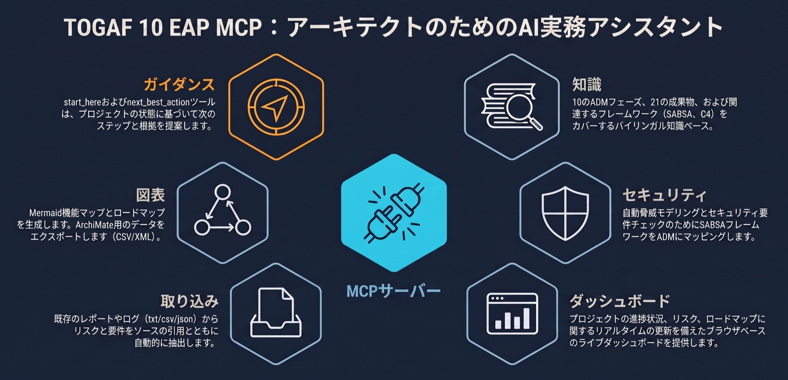

<p align="center">
  
</p>

<h1 align="center">
  
  TOGAF 10 EAP MCP
</h1>
<p align="center">
  <a href="./docs/GETTING-STARTED.md">はじめかた / Getting Started</a> ·
  <a href="./docs/ARCHITECTURE.md">アーキテクチャ / Architecture</a> ·
  <a href="#ツール一覧--tools">ツール一覧 / Tools</a>
</p>

TOGAF® Standard, 10th Edition(Enterprise Architecture Practitioner 体系)をベースにした、**アーキテクト支援・コンサルティング MCP サーバー**です(非公式)。

Claude Code / Claude Desktop などの MCP クライアントから、ADM フェーズの参照、状況に応じたコンサルティング、エンゲージメント(アーキテクチャ案件)の進捗管理、そして **Markdown / ブラウザ両対応のライブダッシュボード** を利用できます。

> **An unofficial, bilingual (JA/EN) MCP server** that acts as a TOGAF-based EA consultant: ADM phase reference, situation-driven consulting, engagement tracking, and a live-updating browser dashboard alongside copy/print-friendly Markdown.

---

## 📖 はじめての方へ / Start here

| これを読む | こんな人向け |
| --- | --- |
| 🍵 **[はじめかた / Getting Started](./docs/GETTING-STARTED.md)** | **TOGAF を知らない人。**入れ方(Claude に頼むだけの方法つき)と、最初に何と言えばいいかの例文集 |
| 🏗 **[アーキテクチャ / Architecture](./docs/ARCHITECTURE.md)** | 中身が気になる人。全体像の図、各層の責務、設計判断とその理由 |
| 📋 [ツール一覧](#ツール一覧--tools) | 何ができるか具体的に知りたい人 |

**とりあえず動かしたい人は [はじめかた](./docs/GETTING-STARTED.md) だけ読めば十分です。** ツール名を覚える必要はありません。

> New here? Read **[Getting Started](./docs/GETTING-STARTED.md)** — it covers installation (including "just ask Claude to install it") and gives you phrases to copy-paste. You never need to memorise tool names.

---

## 1. 何ができるか / What it does

TOGAF の実務上の問題は「分厚い・抽象的・文書中心で、結局いま何をすればいいか分からない」ことです。このサーバーはそこを次の 4 点で解きます。

1. **視覚優先** — 文章の壁ではなく、図・表・マトリクスで返す(Mermaid 図を生成)
2. **次の一手が常に明確** — 「第 7 章を読め」ではなく「今週これをやれ」を返す
3. **実務ツールに接続** — ArchiMate / Archi、C4、BIZBOK、SABSA など現場が実際に使うものに繋ぐ
4. **手元の資料をそのまま入力に** — 情報セキュリティ報告書や指摘一覧を読み込んで、案件の素材に変換する

> The problem with TOGAF in practice is that it is long, abstract, and document-centric — you finish reading and still don't know what to do today. This server answers that with visual-first output, an always-explicit next action, connections to the tools practitioners actually use (ArchiMate/Archi, C4, BIZBOK, SABSA), and document intake so your existing reports become input instead of retyping.

<p align="center">
  
</p>

### 主な機能 / Features

- 🧭 **迷ったら `start_here`** — 状況に応じて「次にやるべき 3 つ」を根拠付きで返す。`next_best_action` / `tailor_adm`(自社版 ADM の設計)
- 📚 **バイリンガル知識ベース** — ADM 全 10 フェーズ、技法 11、成果物 21(全件テンプレート付き)、用語 35、周辺フレームワーク 22、ArchiMate 全 7 層・要素 58・関係 11、SABSA 6 層。すべて日英併記の独自要約
- 🏭 **業界別の能力セット 7** — 銀行 / 保険 / 製造 / 医療 / 小売・EC / 公共 / 通信。事業の説明文から業界を推定し、業界固有の能力を汎用能力に混ぜた**レベル 1 能力マップの草案**を返す(`draft_capability_map`)
- 📊 **図を返す** — 能力マップ、バリューストリーム、アプリ連携図、ADM サイクル、ロードマップのガント、C4 コンテキスト図を Mermaid で生成
- 🔐 **セキュリティ EA** — SABSA の 6 層 × 6 問いを ADM に対応付け。脅威モデルの出発点、セキュリティ要件チェックリスト、案件のセキュリティ点検
- 📥 **既存ドキュメントの取り込み** — 報告書・台帳・指摘一覧(txt/md/csv/json/html)からリスク・ステークホルダー・要件・アクションを**出典行番号付き**で抽出し、案件に取り込む。ファイルパス(`path`)でも、**本文の貼り付け(`text`)でも**受け取る
- 🏗 **ArchiMate 連携** — ADM フェーズ ↔ ArchiMate 要素の対応、関係の妥当性判定、**Archi 取り込み用の CSV / Open Exchange XML 書き出し**。名前を解決できない関係が混じっていても書き出しは止まらず、**解決できた分を出力して落ちた関係を警告に列挙**する
- 📋 **複数案件の管理** — フェーズ進捗・リスク・決定・アクション・ステークホルダー・成果物・ロードマップ・評価を JSON で永続化。案件の切替に対応
- 🔎 **分析とレビュー** — ギャップ分析、リスク行列、ステークホルダー 4 象限、成熟度/変革準備度評価、適合性レビュー用チェックリスト、案件の健全性監査
- 📈 **デュアルダッシュボード** — 会話内で使える Markdown 版と、SSE でライブ更新されるブラウザ版(四半期ロードマップ図・ヒートマップ・印刷用 CSS・ダークモード)
- 🧾 **知識の鮮度を明示** — 依拠している版と最終確認日を返し、正確な原文が要る場面は一次情報へ送る(`about_knowledge` / `check_official_source`)
- 🤖 **Claude API は任意** — このサーバーはすでに LLM の中で動くため通常は不要。大量文書用に `ANTHROPIC_API_KEY` がある場合だけ有効化される

> Highlights: a bilingual knowledge base (10 ADM phases, 11 techniques, 21 deliverables with templates, 35 glossary terms, 22 adjacent frameworks, the full ArchiMate layer/element/relationship set, SABSA); 7 industry capability sets (banking, insurance, manufacturing, healthcare, retail/e-commerce, public sector, telecom) behind `draft_capability_map`; Mermaid diagrams; security-EA lenses; document intake that takes a file path **or** pasted `text`; ArchiMate exports that emit what resolves and warn about what does not; multi-engagement persistence; and a dual Markdown/browser dashboard.

---

## 2. まず試す / Try it

### インストール

```bash
git clone https://github.com/Waganawa-Megumin/togaf10_EAP_MCP.git
cd togaf10_EAP_MCP
npm install
npm run build
```

**Claude Code に登録:**

```bash
claude mcp add togaf-eap -- node /path/to/togaf10_EAP_MCP/dist/index.js
```

**Claude Desktop に登録** — `claude_desktop_config.json` に追加:

```json
{
  "mcpServers": {
    "togaf-eap": {
      "command": "node",
      "args": ["/path/to/togaf10_EAP_MCP/dist/index.js"]
    }
  }
}
```

> 💡 コマンドを打ちたくない場合は、Claude Code に「`/path/to/togaf10_EAP_MCP` にある MCP サーバーを使えるようにして」と頼むだけでも入ります。詳しくは [はじめかた](./docs/GETTING-STARTED.md#2-入れる)。

### 最初に言ってみること

ツール名を覚える必要はありません。**普通の日本語で言えば Claude が道具を選びます。**

- `何から始めればいいか分からない。とりあえず案内して。`
- `基幹システムの刷新を任されたんだけど、何から手を付ければいい?`
- `この報告書からリスクを拾って、案件に登録して。`(ファイルを添付／パスを伝える)
- `関係者の利害を整理したい。営業と生産が対立してる。`
- `うち、過去に 2 回失敗してるんだけど、今度は大丈夫か見てほしい。`
- `経営会議で 1 枚で説明したい。`
- `ダッシュボードをブラウザで開いて。`

**→ 例文はもっとあります: [はじめかた / 最初の一言](./docs/GETTING-STARTED.md#3-最初の一言)**

---

## 3. 詳しく / Reference

### ツール一覧 / Tools

**ツール 84 件 + MCP prompts 8 + resources 8。** 下の表で全 84 件を網羅しています(`node scripts/mcp-cli.mjs tools` で実物を確認できます)。

> **引数の綴りは厳密です。** 全ツールの入力スキーマは `.strict()`(JSON Schema の `additionalProperties: false`)で、**未知のキーは黙って無視されずエラーになります**。`{"phaseId": "B"}` のように綴りが違えば `Unrecognized key(s) in object: 'phaseId'` が返るので、間違ったまま「効いていない」状態に気付かないことはありません。引数名に迷ったら `node scripts/mcp-cli.mjs schema <tool>` で確認してください。
>
> Every tool's input schema is `.strict()` (`additionalProperties: false`), so a misspelled argument is rejected with `Unrecognized key(s) in object: …` instead of being silently ignored.

#### 入口 / Start here

| ツール | 説明 |
| --- | --- |
| `start_here` | 迷ったらここから。状況に応じて最初の一歩、または「今週やるべき 3 つ」を返す |
| `consult` | 状況を自由記述で渡すと、見立て・着目すべきフェーズ・推奨技法・作る成果物・関係者への確認質問を返す(反応したキーワードも開示) |
| `next_best_action` | 案件の状態を分析し、優先度順の具体的な行動を「なぜ今それか」「完了条件」「使うツール」付きで返す |
| `tailor_adm` | 規模・目的・期間から**自社版 ADM** を設計(使うフェーズ / 省くフェーズと理由 / 作る成果物) |
| `explain_for` | 同じ内容を経営層・業務・エンジニア・PMO 向けに言い換える指針とテンプレ |
| `whats_new_for_me` | 直近で動いたもの・**止まっているもの**を要約 |

#### 知識・参照 / Knowledge

| ツール | 説明 |
| --- | --- |
| `list_adm_phases` / `get_adm_phase` | ADM フェーズの目的・入力・ステップ・成果物・実務のコツ |
| `list_techniques` / `get_technique` | ギャップ分析・ビジネスシナリオ等の技法 |
| `list_deliverables` / `get_deliverable` / `generate_deliverable_template` | 成果物の説明と Markdown 雛形(全 21 件) |
| `get_glossary_term` / `search_togaf` | 用語集と知識ベース横断検索(日英) |
| `list_frameworks` / `get_framework` / `recommend_frameworks` / `compare_with_togaf` | BIZBOK・Zachman・C4・Wardley・IT4IT・DDD 等との棲み分けと併用方法 |
| `capability_method` / `check_capability_map` / `value_stream_method` / `cross_map` / `business_architecture_antipatterns` | ビジネスアーキテクチャの**作り方**(能力マップの手順、バリューストリーム、クロスマッピング、アンチパターン検出) |
| `draft_capability_map` | 事業の説明(`businessDescription`)からレベル 1 能力マップの草案を Mermaid で返す。**業界別の能力セット 7 件**(`banking` / `insurance` / `manufacturing` / `healthcare` / `retail-ecommerce` / `public-sector` / `telecommunications`)に対応し、`industry` を省略すると説明文から業界を推定して業界固有の能力を混ぜる(「金融」「地方銀行」のような日本語表記でも指定可) |
| `about_knowledge` / `check_official_source` | この知識ベースの**版と最終確認日**、持っている範囲と持っていない範囲、一次情報の当たり先 |

#### ArchiMate 連携

| ツール | 説明 |
| --- | --- |
| `list_archimate_layers` / `list_archimate_elements` / `get_archimate_element` | 7 層と全要素。要素ごとに「何を表すか」「実務での使い方」「**混同されやすい要素との違い**」 |
| `list_archimate_relationships` / `list_archimate_types` | 関係の種類と、使いどころ・間違えやすい点 |
| `map_togaf_to_archimate` | ADM フェーズごとに「どの層のどの要素で描くか」 |
| `validate_archimate_relationship` | 関係の妥当性を意味論から判定し、不適切なら代替案を返す |
| `suggest_archimate_view` | 関心事から「何を描き、何を描かないか」を提案 |
| `archimate_vs_togaf` | 手法(TOGAF)と記述言語(ArchiMate)の役割分担と、最小限の組み合わせ |
| `export_archimate_csv` / `export_archimate_open_exchange` | **Archi に取り込める** CSV / Open Exchange XML を書き出す。`relations` の `source` / `target` は要素名で指定する。**名前が解決できない関係やタイプ不明の関係があっても全体エラーにはならず**、解決できた分をファイルに出力したうえで、落ちた関係を理由付きで警告に列挙する |

#### セキュリティ EA(SABSA 参照)

| ツール | 説明 |
| --- | --- |
| `list_sabsa_layers` / `map_security_to_adm` | SABSA 6 層 × 6 問いと ADM の対応、フェーズごとに答えるべき問い |
| `threat_model_starter` | 脅威モデリングの出発点(信頼境界、資産 × 6 観点、問うべき質問) |
| `security_requirements_checklist` | 非機能要件として ID 管理すべきセキュリティ要件 |
| `review_security_posture` | 案件のセキュリティ観点の抜けを点検 |

#### 図の生成 / Diagrams(Mermaid)

| ツール | 説明 |
| --- | --- |
| `diagram_adm_cycle` | 現在地を強調した ADM 循環図 |
| `diagram_capability_map` / `diagram_value_stream` | 能力マップ(ヒート付き)、バリューストリーム |
| `diagram_application_landscape` | アプリ連携図(連携が多すぎる場合は警告) |
| `diagram_roadmap_gantt` | ロードマップのガントチャート(移行状態はマイルストーン) |
| `diagram_stakeholder_matrix` / `diagram_risk_matrix` / `diagram_c4_context` | 4 象限、リスク行列、C4 コンテキスト図 |

#### ドキュメント取り込み / Document intake

| ツール | 説明 |
| --- | --- |
| `read_document` | 手元の txt/md/csv/tsv/json/html/xml を正規化して読む(`path` のみ。パス検証・サイズ上限付き) |
| `extract_from_document` | 報告書からリスク・ステークホルダー・システム・要件・アクションを**出典行番号付き**で抽出 |
| `ingest_document` | 抽出候補を案件に取り込む(既定はプレビューのみ。`apply=true` で反映) |
| `summarize_document_for_architecture` | アーキテクチャ観点での読み取り方と該当箇所 |

`extract_from_document` / `ingest_document` / `summarize_document_for_architecture` は **`path`(ファイルパス)と `text`(本文の貼り付け)のどちらでも**受け取ります。`source` に元ファイル名を添えると出典表示に使われます。

**PDF / Word / Excel は `path` で渡さず、Claude Code に読ませて本文を `text` で渡すのが本筋です。**サーバー側にパーサを持たせるとバイナリ形式の数だけ依存が増え、レイアウト崩れの責任も抱え込むことになります。ホスト(Claude Code)はすでにこれらを読めるので、読解はホストに任せ、サーバーは**抽出と案件への反映**に専念します。`text` で渡した場合、出典の行番号は「渡された本文内の行」であり元ファイルのページ・行とは一致しないことがあるので、その旨は出力にも明記されます。

> Pass `path` for plain-text formats. For PDF/Word/Excel, let Claude Code read the file and hand the body to these tools as `text` — the server deliberately ships no binary parsers. Line numbers then refer to the pasted body, which the output states explicitly.

#### 分析・レビュー / Analysis

| ツール | 説明 |
| --- | --- |
| `gap_analysis` | 現行 × 目標のマトリクスとギャップ一覧(**廃止側も必ず出す**) |
| `risk_matrix` / `stakeholder_matrix` | リスク行列、影響力 × 関心度の 4 象限と関与方針 |
| `assess_maturity` / `assess_readiness` | EA 成熟度・変革準備度の評価(案件に保存) |
| `generate_review_checklist` | 適合性レビュー用チェックリスト(1 ページに収まる分量) |
| `check_engagement_health` | 案件の危険信号を自動検出(スポンサー不在、期限超過、owner なし critical リスク等) |

#### 案件・ロードマップ・出力 / Engagement

| ツール | 説明 |
| --- | --- |
| `start_engagement` / `get_engagement` / `update_engagement` | 案件の作成・参照・部分更新 |
| `list_engagements` / `create_engagement` / `switch_engagement` / `archive_engagement` / `delete_engagement` | 複数案件の管理 |
| `review_all_engagements` | 全案件を 1 つの表に並べ、**危ない順**に「止まっている / 要注意 / 動いている」を判定(止まっている案件は件名まで出す) |
| `add_transition_state` / `add_work_package` / `get_roadmap` / `prioritize_work_packages` / `remove_roadmap_item` | 移行アーキテクチャと作業パッケージ(価値 × 規模で 4 象限に分類) |
| `get_dashboard` / `open_dashboard` | Markdown ダッシュボード / ブラウザのライブダッシュボード(`TOGAF_EAP_NO_BROWSER` を設定するとブラウザを起動せず URL だけ返す) |
| `export_report` / `export_deliverable` / `list_exports` | 配布・印刷用のファイル書き出し |

#### 任意: Claude API

| ツール | 説明 |
| --- | --- |
| `llm_status` | API キーの有無と設定方法(**キーの値は表示しない**) |
| `analyze_text_with_claude` | 大量文書の解析。キーが無い場合はエラーにせず、ホスト側 LLM 用のプロンプトを整形して返す |
| `estimate_tokens` | トークン数(API があれば正確に、無ければ概算と明示) |

#### MCP prompts / resources

`phase_kickoff`, `architecture_review`, `exec_summary`, `stakeholder_briefing`, `risk_workshop`, `gap_workshop`, `deliverable_draft`, `weekly_status` の 8 プロンプトと、`togaf://phases`, `togaf://phase/{id}`, `togaf://technique/{id}`, `togaf://deliverable/{id}`, `togaf://glossary`, `togaf://engagement/current` などのリソースを公開します。

### 設定 / Configuration

| 環境変数 | 既定値 | 説明 |
| --- | --- | --- |
| `TOGAF_EAP_DATA_DIR` | `~/.togaf-eap` | エンゲージメント状態の保存先ディレクトリ |
| `TOGAF_EAP_DASHBOARD_PORT` | `0`(空きポート自動割当) | `open_dashboard` が listen するポート |
| `TOGAF_EAP_NO_BROWSER` | (未設定) | 値を入れる(`0` / `false` / 空文字は無効)と `open_dashboard` がブラウザを自動起動せず、URL だけ返す。CI・ヘッドレス環境向け |
| `ANTHROPIC_API_KEY` | (未設定) | **任意**。設定時のみ `analyze_text_with_claude` が Claude API を使う。未設定でもエラーにはならず、ホスト側 LLM 用のプロンプトを返す |
| `TOGAF_EAP_CLAUDE_MODEL` | `claude-opus-5` | **任意**。Claude API を使う場合のモデル |

保存レイアウトは次のとおりです。複数案件を並行して持てます。

```
~/.togaf-eap/
├── index.json              # 索引(選択中の ID + 一覧)
├── engagements/<id>.json   # 各案件の本体
├── reports/                # export_report の出力先
├── deliverables/           # export_deliverable の出力先
└── archimate/              # Archi 取り込み用ファイルの出力先
```

旧レイアウト(`~/.togaf-eap/engagement.json` に 1 件)のデータは初回アクセス時に自動移行します(旧ファイルは保険として残します)。書き込みは一時ファイル + rename の atomic 書き込みなので、ダッシュボードが書きかけの JSON を読むことはありません。詳しくは [アーキテクチャ / 状態の持ち方](./docs/ARCHITECTURE.md#5-状態の持ち方)。

Engagements live in `~/.togaf-eap/` (override with `TOGAF_EAP_DATA_DIR`): an `index.json` plus one file per engagement under `engagements/`. A pre-existing single-file `engagement.json` is migrated automatically on first access and kept as a backup. Writes are atomic (temp file + rename), so the dashboard never reads a half-written file.

#### ファイル読み書きの制約 / File access limits

`read_document` などのドキュメント取り込みは、**カレント作業ディレクトリ配下・データディレクトリ配下・ホーム配下**に限定され、隠しディレクトリ(`.` 始まり)は読みません(資格情報ファイルの誤読を避けるため)。書き出し系はデータディレクトリ配下かカレント配下のみで、既存ファイルは `overwrite=true` がなければ上書きしません。

PDF / Word / Excel など、テキストでない形式は**クライアント側(Claude Code)に読ませて本文を渡します**。`extract_from_document` / `ingest_document` / `summarize_document_for_architecture` は `path` の代わりに `text` を受け取れます(`read_document` は `path` のみ)。理由は [アーキテクチャ / ホストにできることはホストにやらせる](./docs/ARCHITECTURE.md#31-ホストにできることはホストにやらせる) を参照。

#### ダッシュボードのエンドポイント / Dashboard endpoints

`open_dashboard` は `127.0.0.1` のみに bind します(外部公開しません)。

| パス | 内容 |
| --- | --- |
| `/` | ダッシュボード HTML(自己完結・外部 CDN 参照なし・印刷用 CSS 付き) |
| `/api/state` | 現在のエンゲージメント JSON |
| `/events` | SSE。状態ファイルの変更を push |
| `/health` | 死活確認 |

### 開発 / Development

```bash
npm run build   # TypeScript ビルド
npm test        # vitest ユニットテスト
npm run smoke   # stdio JSON-RPC スモークテスト
```

手でツールを叩いて出力を確認するには、同梱の CLI を使います。

```bash
node scripts/mcp-cli.mjs tools --quiet                    # ツール一覧
node scripts/mcp-cli.mjs schema <tool>                    # 入力スキーマ
node scripts/mcp-cli.mjs call <tool> '<JSON>' --data-dir /tmp/scratch --quiet
```

設計判断・層の責務・拡張のしかたは [アーキテクチャ](./docs/ARCHITECTURE.md) にまとめてあります。

---

## ライセンス / License

**個人利用のみ・AI 学習禁止** のカスタムライセンスです。詳細は [LICENSE.md](./LICENSE.md) を参照してください。

Personal use only; AI/ML training on this repository is prohibited. See [LICENSE.md](./LICENSE.md).

## 商標に関する注記 / Trademark Notice

TOGAF® および ArchiMate® は The Open Group の登録商標です。SABSA® は The SABSA Institute の登録商標です。BIZBOK® は Business Architecture Guild の登録商標です。本プロジェクトは非公式であり、これらの団体とは一切関係がありません。

収録している知識ベースは、**名称・レイヤ構成・マトリクスの軸といった事実情報**と、**完全に独自の要約・解説**のみで構成されています。いずれの規格・ガイドについても、原文の複製や逐語的な言い換えは含みません。

### なぜ原文を収録しないのか / Why no source text is included

TOGAF 標準は**オンラインでの閲覧は無料**で、**自組織のアーキテクチャ策定に自由に使える**一方、**複製・再配布は許諾なく認められていません**(TOGAF Standard 10th Edition, §1.3.1 Conditions of Use)。さらに原本の著作権表記は、書面の許諾なく本文を **LLM / 生成 AI の学習・開発、およびそれらのツールと関連してデータやコンテンツを生成する目的で利用・組み込むこと**を明示的に禁じています。

本プロジェクトは MCP サーバーとして AI から利用されるものであるため、この条項に抵触しないよう、著作権の及ばない**事実情報**(フェーズ名・成果物名などの構造)のみを用い、解説は**すべて独自に執筆**しています。正確な原文が必要な場面では `about_knowledge` / `check_official_source` が一次情報の当たり先を返します。

The TOGAF Standard is free to view online and free to use for developing your own organization's architecture, but it may not be reproduced or redistributed without permission, and its copyright notice explicitly prohibits incorporating the text into LLM/generative-AI systems or using it in connection with such tools to generate content. Since this project is consumed by an AI assistant, it therefore carries only non-copyrightable factual structure plus wholly original commentary.

TOGAF® and ArchiMate® are registered trademarks of The Open Group; SABSA® of The SABSA Institute; BIZBOK® of the Business Architecture Guild. This project is unofficial and not affiliated with any of them. The knowledge base carries only factual structure (names, layers, matrix axes) plus wholly original commentary — it reproduces no source text, verbatim or closely paraphrased.

---

<sub>☕ このツールでステークホルダー表を作る午後が浮いたなら、[Ko-fi](https://ko-fi.com/shonanboyeah) で開発を応援できます(もちろん任意です)。<br>
If this saved you an afternoon of stakeholder spreadsheets, you can support development on [Ko-fi](https://ko-fi.com/shonanboyeah) — entirely optional.</sub>
