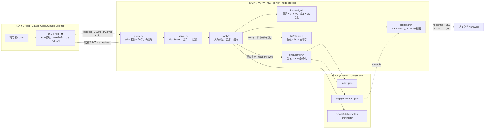
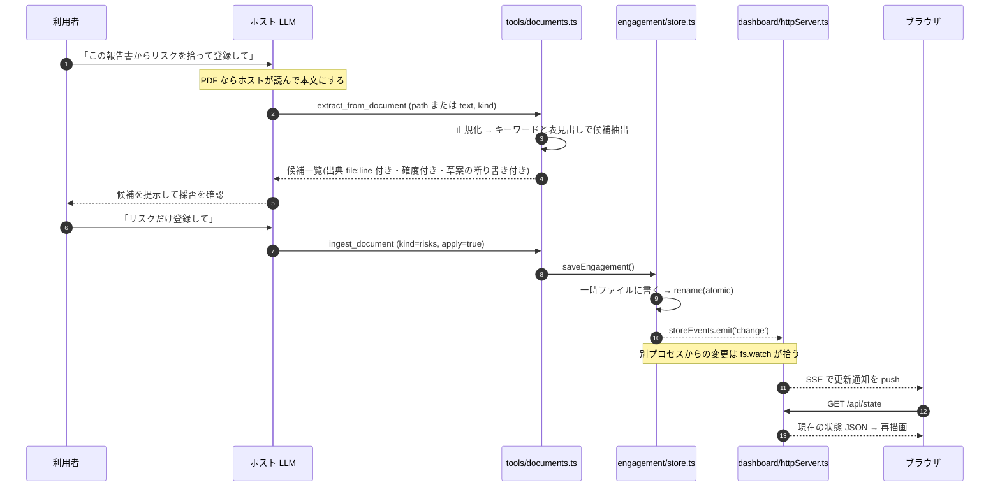

<a href="../README.md"> ← README に戻る / Back to README</a> ・ <a href="./GETTING-STARTED.md">はじめかた / Getting Started</a>

# アーキテクチャ / Architecture

このサーバーがどう組まれているか、そして**なぜそう組んだか**の簡略な解説です。使い方の案内は [はじめかた](./GETTING-STARTED.md) にあります。

> A short tour of how this server is built and why. For usage, see [Getting Started](./GETTING-STARTED.md).

---

## 1. 全体像

一言でいうと、**状態を持った知識サーバー**です。ホスト(Claude Code / Claude Desktop)と stdio の JSON-RPC で会話し、静的な知識ベースと、ディスク上のエンゲージメント状態を材料に、表・図・次の一手を返します。ネットワークには出ません(任意の Claude API 連携を除く)。

> In one sentence: a stateful knowledge server. It speaks JSON-RPC over stdio to the host, and composes answers from a static knowledge base plus engagement state on disk. It makes no network calls (except the optional Claude API path).



ポイントは 3 つです。

- **ホストとの境界は stdio 1 本**。stdout は JSON-RPC 専用なので、ログはすべて stderr に出します
- **ダッシュボードだけが別経路**。`127.0.0.1` に bind した node:http サーバーを開き、ブラウザが直接見に来ます
- **知識ベースは読み取り専用の静的データ**。書き込まれるのはエンゲージメント状態だけです

---

## 2. ディレクトリ構成と各層の責務

```
src/
├── index.ts          エントリ。stdio トランスポートで起動し、SIGINT/SIGTERM で後始末する
├── server.ts         McpServer を作り、register*Tools() を順に呼んで全ツールを登録する
├── knowledge/        知識ベース(静的・バイリンガル・副作用なし)
├── engagement/       エンゲージメントの型と JSON 永続化
├── dashboard/        Markdown / HTML の描画と、SSE 付き HTTP サーバー
├── tools/            MCP ツールの実装(ツール登録 20 + prompts/resources 2 + 共通ヘルパ 3)
└── llm/              任意の Claude API クライアント
```

現在の規模は **ツール 84 / prompts 8 / resources 8**。`tools/` の分割単位は 1 モジュール = 1 つの関心事(知識参照、案件更新、図の生成、書き出し…)で、ツールが増えてもファイルは増えにくいようにしてあります。

| 層 | 責務 | してはいけないこと |
| --- | --- | --- |
| `knowledge/` | ADM フェーズ・技法・成果物・用語・ビューポイント・周辺フレームワーク・ArchiMate・SABSA の**事実構造と独自解説**を `{ ja, en }` 型で保持。横断検索と、状況記述からのルールマッチも提供 | ファイル I/O、ネットワーク、状態の保持 |
| `engagement/` | `model.ts` が型(フェーズ進捗・リスク・決定・アクション・関係者・成果物・ロードマップ・評価)、`store.ts` が JSON 永続化と変更イベントの発火 | 表示の整形(Markdown / HTML を組み立てない) |
| `dashboard/` | 同じ状態から Markdown 版とブラウザ版を描く。`labels.ts` で日英ラベルを共有し、両者の表記が食い違わないようにする | 状態の変更 |
| `tools/` | zod でスキーマを定義し、入力を検証し、知識と状態を突き合わせ、**表・図・次の一手**として整形する。`common.ts` の `textResult` / `errorResult` / `langSchema` / `msg` を共通で使う | 例外を投げること(後述) |
| `llm/` | Claude Messages API への薄い fetch クライアント。`ANTHROPIC_API_KEY` があるときだけ働く | 必須依存になること |

`tools/` が厚く(実装の大半)、`knowledge/` がその材料、`engagement/` と `dashboard/` が状態と見せ方 — という重心です。

> `tools/` holds most of the code: it validates input with zod, joins knowledge with stored state, and formats the result as tables, diagrams, and next actions. `knowledge/` is pure static data, `engagement/` is types plus persistence, `dashboard/` renders the same state two ways. The right-hand column of the table above is what each layer may *not* do: `knowledge/` never touches the filesystem, the network, or state; `engagement/` never builds Markdown or HTML; `dashboard/` never mutates state; and a tool handler never throws.

---

## 3. 設計判断とその理由

### 3.1 ホストにできることはホストにやらせる

このサーバーは **Claude Code の中で動きます**。つまり呼び出し側は、PDF を読む・Web を取りに行く・大量のテキストを解釈する能力を**すでに持っています**。それをサーバー側で作り直すのは、依存を増やし、バグを増やし、しかもホストより下手にやることになります。

そこで役割をこう分けています。

| やりたいこと | 誰がやるか | サーバー側の作り |
| --- | --- | --- |
| PDF / Word / Excel / メールを読む | **ホスト** | 取り込み系ツールは `path` のほかに `text` を受け取る。ホストが読んだ本文をそのまま渡せる |
| Web の一次情報を確認する | **ホスト** | `check_official_source` は URL と「どういうときに見に行くべきか」を返すだけ。サーバーは通信しない |
| 長文の意味を解釈する | **ホスト** | `analyze_text_with_claude` は API キーが無ければエラーにせず、**そのまま使えるプロンプト**を返す |
| 構造化・突き合わせ・状態管理 | **サーバー** | ここがサーバーの本体。決定的な処理で、出典行番号を必ず添える |

結果として、外部ライブラリなしで PDF も Excel も扱えます(ホストが読んで本文をくれるので)。

> The server runs *inside* an LLM client that can already read PDFs, fetch the web, and interpret long text. Re-implementing that server-side would add dependencies and do it worse. So intake tools accept `text` as well as `path`, source-checking returns URLs instead of fetching them, and the optional LLM tool degrades into "here is the prompt, you run it".

### 3.2 依存は `@modelcontextprotocol/sdk` と `zod` の 2 つだけ

導入の敷居と供給網リスクを下げるため、npm 依存を増やさない方針を最初に決めています。

- **HTTP サーバーは `node:http`** — express も ws も入れない。SSE は「`text/event-stream` を返して書き続ける」だけなので、標準モジュールで十分
- **Claude API は `fetch` 直叩き** — 公式 SDK を入れない。使うのは 1 往復のテキスト生成とトークン数えだけで、Node 標準の `fetch` で足ります。呼び出し側には `callClaude` / `countClaudeTokens` しか見せていないので、将来 SDK に差し替えるとしてもこの層だけの変更で済みます
- **ドキュメント解析も標準モジュールのみ** — テキスト系(txt / md / csv / tsv / json / html / xml / log)を自前で正規化する。バイナリ形式は 3.1 のとおりホストに任せる

`npm install` が引くパッケージが少ないほど、審査を通る確率が上がります。EA の道具は「配れないと意味がない」ので、ここは機能より優先しています。

> Two runtime dependencies, deliberately. `node:http` instead of express, `fetch` instead of the Anthropic SDK, hand-rolled text normalization instead of parser libraries. An EA tool that cannot get past review is worthless, so a small dependency tree outranks convenience.

なお、これは設計方針の話です。**利用できる範囲はライセンスが決めます** — 本成果物は個人利用のみで、企業・組織としての利用には著作権者の事前の書面による許可が必要です([LICENSE.md](../LICENSE.md))。

*That is a design rationale, not a grant of use: the [license](../LICENSE.md) permits personal, non-commercial use only. Organizational use requires prior written permission.*

### 3.3 原文を持たない

TOGAF / ArchiMate / SABSA いずれも、**閲覧は自由でも複製・再配布は許諾されていません**。さらに TOGAF 標準の著作権表記は、本文を LLM / 生成 AI の学習・開発に組み込むことを明示的に禁じています。このサーバーはまさに AI から使われるものなので、この線は越えられません。

そこで知識ベースには次のものだけを置いています。

- **事実**: フェーズ名、成果物名、レイヤ構成、マトリクスの軸 — 著作権の及ばない構造情報
- **独自解説**: 実務でどう使うか、どこで壊れるか、何を先に決めるか — すべて書き下ろし

この制約は、実は製品の性格に合っています。原文の要約が要るなら標準を読めばよく、このサーバーの価値は「で、明日何をするのか」の側にあるからです。

一方で「標準に何と書いてあるか」を正確に知りたい場面は必ず来るので、そこは**逃げずに一次情報へ送ります**。

- `about_knowledge` — 依拠している版、**最後に一次情報と突き合わせた日**、持っている範囲と持っていない範囲
- `check_official_source` — 話題に応じた公式 URL と、「どういうときに見に行くべきか」

知識の鮮度を明示する日付(`KNOWLEDGE_BASELINE.lastVerified`)を持たせているのは、**日付が無いより、古い日付が見えているほうが安全**だからです。日付が無いと利用者は最新だと誤認します。

> None of these standards license reproduction, and TOGAF's copyright notice explicitly forbids feeding its text into LLM systems — which is exactly what an MCP server would be doing. So the knowledge base carries only non-copyrightable structure plus wholly original commentary, and when you need the actual wording, `about_knowledge` and `check_official_source` hand you the primary source, along with the date this server was last checked against it.

### 3.4 ツールハンドラは例外を投げない

MCP のツールが例外で落ちると、ホストには扱いにくい失敗として伝わります。このサーバーは**必ず捕捉して `errorResult`** を返し、その本文に「何が足りなかったか」と「次にどうすればよいか」を書きます。

引数なしで呼ばれたときも同じ思想です。エラーにせず、**入れるべき項目の説明と、コピペできる JSON の例**を返します(`assess_readiness '{}'` が典型)。前提知識ゼロの人が最初に打つのは、たいてい空の呼び出しだからです。

> Handlers never throw; they return an error result whose body says what was missing and what to do next. Called with no arguments at all, tools answer with the fields they want plus a copy-pasteable example — because an empty call is what a first-time user actually types.

### 3.5 入力スキーマは strict — 綴り違いは黙って捨てない

MCP SDK の既定では、スキーマに無いキーは**黙って捨てられます**。呼び出し側が `relations` を `relationships` と打ち間違えても、返るのは「関係 0 件」の正常な結果です。呼んでいるのが LLM である以上、これは必ず起きます。

そこで `server.ts` の `strictifyToolSchemas()` が全ツールのスキーマを一括で `.strict()` に包み、未知のキーをその場でエラーにします。**空の正解より、明示された失敗のほうが安い**という判断です。ツール側は生のシェイプのまま書けるので、型推論も書き味も変わりません。

> The SDK silently drops unknown keys, so a typo returns a clean, empty, wrong answer — and the caller here is an LLM, so typos are certain. `strictifyToolSchemas()` wraps every tool's schema in `.strict()` at registration so a misspelled key fails loudly instead. A visible failure is cheaper than a plausible void.

---

## 4. データの流れ(1 例)

「セキュリティ報告書を渡す → 候補を抽出 → 案件に登録 → ダッシュボードが勝手に更新される」を追います。



見どころは 2 つです。

- **`apply=true` が無ければ保存しない**。抽出は必ずプレビューを挟みます。機械の推定値(レベル・影響度・期限)は仮置きだと明示され、各行に出典行番号が付きます
- **保存は atomic**。一時ファイルに書いてから `rename` するので、ダッシュボードが書きかけの JSON を読むことはありません

> Reading the sequence above: a document arrives (the host reads it if it is a PDF), the server normalizes it and pulls candidates out with a `file:line` source and a confidence on every row, and the user decides what to keep. Nothing is written without `apply=true` — machine-guessed levels, impacts and dates are labelled as provisional. The save itself is atomic (temp file, then `rename`), and the change reaches the browser over SSE, whether it came from this process or another one.

---

## 5. 状態の持ち方

```
~/.togaf-eap/                    # TOGAF_EAP_DATA_DIR で変更可
├── index.json                   # 索引: 選択中の ID + 案件一覧(軽い)
├── engagements/<id>.json        # 案件本体(1 案件 1 ファイル)
├── reports/                     # export_report の出力
├── deliverables/                # export_deliverable の出力
└── archimate/                   # Archi 取り込み用 CSV / Open Exchange XML
```

- **DB ではなく JSON にした理由** — 状態は「1 人のアーキテクトの案件が数十件」であって、同時書き込みも全文検索も要りません。その規模で SQLite を入れると、依存が 1 つ増え、スキーマ移行の仕事が生まれ、そして**利用者が中身を読めなくなります**。JSON なら `cat` で見え、`git` で差分が取れ、壊れたらエディタで直せる。EA の成果物は「後から人が読んで疑える」ことが要件なので、そこを人間可読側に倒しました
- **索引と本体を分けた理由** — 一覧・切替は索引だけ読めば済み、案件が増えても軽いままだからです。1 ファイルに全案件を詰めると、1 件更新するたびに全体を書き直すことになります
- **atomic 書き込み** — 一時ファイル + `rename`。ダッシュボードが並行して読んでいても壊れません
- **変更の伝播は 2 経路** — 同一プロセス内は `storeEvents`(EventEmitter)、外部からの変更は `fs.watch`。`recursive` は環境依存なので使わず、データディレクトリと `engagements/` を別々に監視しています
- **旧レイアウトの自動移行** — 単一ファイル(`engagement.json`)だった頃のデータは初回アクセス時に新レイアウトへ移し、旧ファイルは保険として残します
- **ID はファイル名として検証済み** — 外部由来の文字列がパスに化けないよう、案件 ID の形式を検査してから使います

読み書きの範囲も絞っています。ドキュメント読み込みは**作業ディレクトリ配下・データディレクトリ配下・ホーム配下**に限定し、`.` で始まる隠しディレクトリ／隠しファイルは読みません(資格情報ファイルの誤読を避けるため)。書き出しはデータディレクトリ配下か作業ディレクトリ配下のみで、既存ファイルは `overwrite=true` が無ければ上書きしません。

> Plain JSON rather than a database: at this scale there is no concurrency and no search to speak of, and a database would cost a dependency, a migration story, and — worst — the user's ability to read their own data. Files you can `cat`, diff in git, and repair in an editor matter more here. An index file plus one file per engagement keeps listing and switching cheap; writes are atomic; changes propagate in-process via an EventEmitter and out-of-process via `fs.watch`. Reads are confined to the working directory, the data directory, and the home directory, with dotfiles excluded.

---

## 6. ダッシュボードの経路

`open_dashboard` は `127.0.0.1` にのみ bind した node:http サーバーを立てます(外部公開しません)。多重起動はせず、既に動いていれば同じ URL を返します。ポートは既定 `0`(空きポート自動割当)、`TOGAF_EAP_DASHBOARD_PORT` で固定できます。

| パス | 内容 |
| --- | --- |
| `/` | ダッシュボード HTML。**自己完結**(外部 CDN 参照なし)、印刷用 CSS とダークモード対応つき |
| `/api/state` | 現在のエンゲージメント JSON |
| `/events` | SSE。状態の変更を push する |
| `/health` | 死活確認 |

同じ状態を Markdown 版(`get_dashboard`)でも返せるようにしてあるのは、**会話の中にそのまま貼れること**が実務では効くからです。ラベルは `dashboard/labels.ts` で共有しているので、2 つの版で表記が食い違いません。

> The dashboard binds to loopback only, serves a self-contained HTML page with print CSS, and pushes updates over SSE. The same state also renders as Markdown so it can be pasted straight into a conversation; both renderers share one label table.

---

## 7. 拡張するときの型

新しいツールを足すときは、次の形に従うと既存と揃います。

1. `src/tools/<領域>.ts` に `registerXxxTools(server: McpServer)` を作る
2. 入力は zod で定義し、説明文は**日英併記**にする(ホストがツール選択に使うため、ここの品質がそのまま使い勝手になる)
3. ハンドラは try/catch で囲み、失敗時は `errorResult` に「何が足りないか」「次に何をすればよいか」を書く
4. 外部由来の文字列を Markdown 表に入れる前に、パイプをエスケープし改行を畳む
5. `src/server.ts` の `createServer()` から呼ぶ
6. `tests/` に vitest を足し、`scripts/mcp-cli.mjs` で実際に呼んで出力を目視する

```bash
node scripts/mcp-cli.mjs tools --quiet          # ツール一覧(現在 84 件)
node scripts/mcp-cli.mjs schema <tool>          # 入力スキーマ
node scripts/mcp-cli.mjs call <tool> '<JSON>' --data-dir /tmp/scratch --quiet

npm test        # vitest
npm run smoke   # dist を子プロセスで起動して stdio JSON-RPC を通しで検証
```

**「入力が違えば出力の中身が変わる」ことが、このサーバーの品質基準です。** 見出しだけ変わって本文が同じなら、そのツールはまだ役に立っていません。2 つの異なる入力で呼んで diff を取ってから完成としてください。

> Add tools as a `registerXxxTools(server)` module, define input with zod in both languages, never throw, escape pipes in externally-sourced strings, and register from `createServer()`. The quality bar: different input must change the *substance* of the output, not just the headings — check it by diffing two real calls.

---

## 次に読むもの

- [はじめかた / Getting Started](./GETTING-STARTED.md) — 入れ方と、最初に何と言えばいいか
- [実際の出力例 / Examples](./EXAMPLES.md) — ここで説明した整形が実際にどう出るか
- [README](../README.md) — ツール 84 件の一覧、設定、ライセンス
